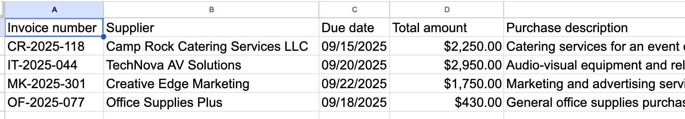
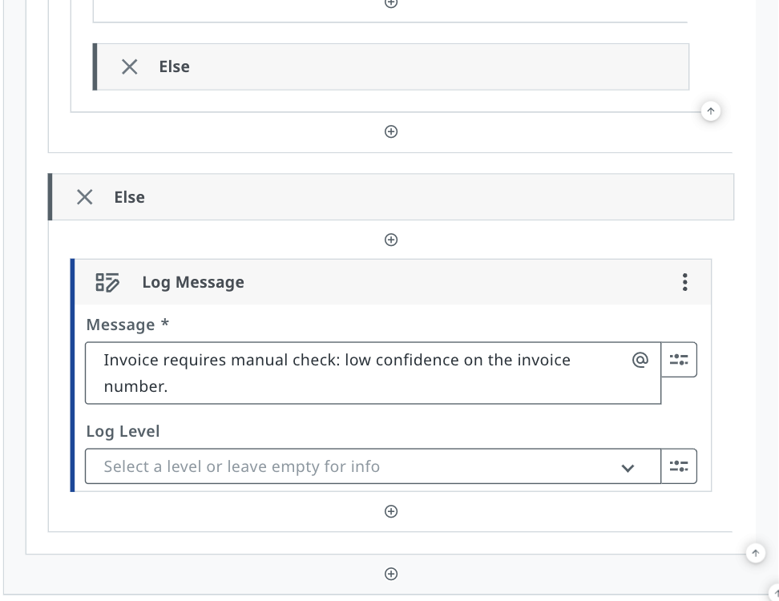

## About This Project

This workflow automates the manual process of reading, extracting, 
and reporting on supplier invoices for Finance teams.

Previously, Finance staff had to manually open each invoice, copy 
fields into a spreadsheet, and write a short note describing the 
purchase — a slow, repetitive, and error-prone process.

This UiPath automation replaces that entirely by:

- Reading invoice files directly from a Google Drive folder
- Extracting key fields (invoice number, supplier, due date, 
  total amount) using UiPath Document Understanding
- Checking extraction confidence and flagging low-quality 
  results before they reach the spreadsheet
- Generating a plain-language purchase description 
  (max 15 words) using GenAI Content Generation
- Writing all results into a structured Google Sheet 
  ready for Finance review

## Tools & Technologies

- UiPath Web Studio
- UiPath Document Understanding (Predefined Invoices extractor)
- UiPath GenAI Activities (Content Generation)
- Google Drive integration
- Google Sheets integration

## How It Works

1. The workflow loops through each invoice in a Google Drive folder
2. Document Understanding extracts invoice number, supplier, 
   due date, and total amount from each file
3. If the confidence score on the invoice number is below 0.7, 
   a warning is logged and the invoice is skipped for manual review
4. For high-confidence invoices, GenAI generates a short 
   purchase description based on the extracted data
5. All five fields are written as a row into Google Sheets
6. Finance managers filter the sheet by due date to view 
   only invoices due on or before their target date

## Key Features

- Automatic data quality checks via confidence scoring
- AI-generated purchase descriptions for instant context
- Zero manual data entry required
- Scales to any number of invoices without extra effort
- Flags problem invoices before they reach Finance

## What I'd Improve Next

- Add due date filtering inside the workflow itself
- Expand confidence checks to cover all extracted fields
- Send automated email alerts for flagged invoices
- Add error handling for unreadable or corrupted files

## Workflow Screenshot
![Workflow]
(workflowContentGen.png
workflowElse.png
workflowFold&ExtractDoc.png
workflowIfCondition.png
workflowWriteRow.png)

## Google Sheet Output

## Log Messages

